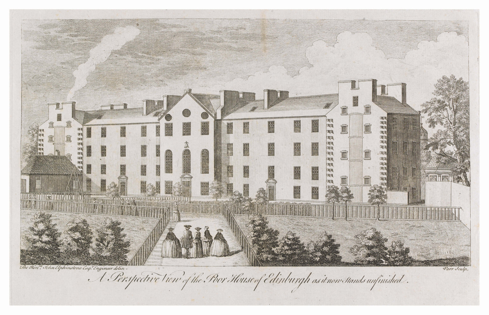

**Comments and corrections on this brief history are welcome.**

The building at 5 Forrest Hill, until 2008 occupied by the University
of Edinburgh School of Informatics, comprises three historically
distinct portions:

-   The garage, originally built as a Drill Hall in 1871
-   The north-most part of the building, which abuts Greyfriars Kirkyard.
    This section was built as part of the former Poor House, or Charity
    Workhouse, some time between 1817 and 1852
-   The central part of the building containing the frontage and the
    stairwell, dating from the late 19th or early 20th century.

### North Wing: The Edinburgh Charity Workhouse or Poor House

The Charity Workhouse has its origins around 1740, when, according to
Arthur Birnie in his book *The Edinburgh Charity Workhouse, 1740-1845*,
the Town Council and the kirk-sessions agreed to construct a Charity
Workhouse where, to stamp out a plague of beggars, "the city poor could
be housed and set to work". According to Peter Higginbotham on
[workhouses.org.uk](http://www.workhouses.org.uk/Edinburgh):

> The Edinburgh Charity Poorhouse in Port Bristo was built in 1739-1743
> by Samuel Neilson, mason, and William McVey and James Heriot, wrights.
> It was financed by voluntary subscriptions. Funds for its operation
> were raised by a variety of means such as a tax on the valued rents of
> the city, collections at church doors, charitable donations and other
> contributions including an annual benefit play at one of the city's
> theatres. It was a substantial establishment that, in 1777-8, could
> accommodate 484 adults and 180 children.

The OS map of 1852 (available from
[workhouses.org.uk](http://www.workhouses.org.uk/Edinburgh) or the
[National Library of
Scotland](http://www.nls.uk/maps/townplans/edinburgh1056_1_sw.html))
shows the West wing of the Edinburgh Poor House to be located where the
north-most part of the current building (right) stands.

*West wing of Edinburgh Poor House. The OS map from 1852 describes
this as "The West Wing, for Women and Children" of the Edinburgh
Poorhouse. It does not appear in Kirkwood's plan of 1817.*

The wing is marked as being for women and children. The wing does not appear in
[Kirkwood's 1817 plan of Edinburgh](http://www.nls.uk/maps/early/416.html). Birnie does not
mention the building of this wing, though he does mention the problems
that the managers of the Charity Workhouse had in the mid-nineteenth
century accommodating children.

Part of the original Poor House building, constructed in 1743, still
exists. It is the building shown in the first picture at the right
(covered in scaffolding), that protrudes into Forrest Hill. Most of the
building was demolished to make way for the Drill Hall in 1871, but one
end of the "Main Wing" (as it is denoted on the 1852 OS map) remains.

*A perspective view of the Poor House of Edinburgh as it now stands
unfinished. This engraving by John Elphinstone shows the Poor House as
it would have looked very shortly after it was built in 1743. The
"unfinished" in the engraving caption suggests that the Poor House was
originally intended to be larger, perhaps with extra wings, as shown
in Maitland's engraving. However, the city maps suggest that the Poor
House was not extended until some time between 1817 and 1845. This
image is copyright City of Edinburgh Council and is reproduced with
permission. For more information about the image, see the
[Capital Collections](http://www.capitalcollections.org.uk/) website.*

Elphinstone's engraving *A Perspective View of the Poor House of
Edinburgh as it now stands unfinished* shows how the Poor House would
have looked shortly after it was built. The remaining section is the
rightmost section of the building. The caption to the engraving
suggests that the Poor House was intended to be larger. Another
contemporary engraving of the Poor House, from Maitland's 1753
*History of Edinburgh*, shows the Poor House with two wings projecting
out from the Main Wing, but there is no evidence that these were built
at the time. However, according to the maps, between 1817 and 1852,
the buildings on the north side of Forrest Hill but to the east of the
Poor House remnant already mentioned were built.

*Maitland's engraving of the charity workhouse*

According to Birnie, in 1870 a new Poor House was opened at
Craiglockhart Hill, and the Charity Workhouse was demolished to make
way for the new Drill Hall. In fact the maps suggest that part of the
Poor House remained. A [contemporary description of the new Poor House
at Craiglockhart](http://www.workhouses.org.uk/Edinburgh) is available
from [www.workhouses.org.uk](http://www.workhouses.org.uk).

There is also [some information on the Charity
Workhouse](http://www.oldandnewedinburgh.co.uk/volume4/page144.html) in
*Cassell's Old and New Edinburgh* by James Grant.

### Circa 1871: Fever hospital

From this [history of the City
Hospital](http://www.lhsa.lib.ed.ac.uk/exhibits/hosp_hist/city.htm) in
the Lothian Health Service Archive:

> In 1867 the Public Health (Scotland) Act gave power to local
> authorities to make provision for the treatment of infectious diseases
> during periods of epidemics .... as the Managers of the Royal
> Infirmary refused to admit cases of smallpox or cholera, premises in
> King's Stables Road and in part of the poorhouse in Forrest Road were
> fitted up as temporary hospitals to meet any emergency that might
> arise.
>
> After the Royal Infirmary moved to Lauriston Place in 1879 its
> Managers used Old Surgeons' Hall for the treatment of infectious
> fevers during ordinary seasons.

### 1872-1990 Army

*Plaque on side of Greyfriars Kirk, which reads: Regiment raised 1859.
Headquarters rebuilt and opened 6th May 1905 by HRH the Duke of
Connaught KT. Colonel Sir Robert Cranston VD. Colonel Comandant of
Brigade. Lord Provost of the City.*

According to the
[Dictionary of Scottish Architects](http://www.scottisharchitects.org.uk/building_full.php?id=208853)
the Drill Hall was constructed in 1872, designed by the practice of
[Stewart and Menzies](http://www.scottisharchitects.org.uk/architect_full.php?id=201733),
who had been involved in a faulty water supply scheme for Dundee.
According to the plaque on the side of Greyfriars Kirk, the Drill Hall
was opened on 21st December 1872 and was occupied at first by the
Queen's City of Edinburgh Volunteer Rifle Brigade, and then a
succession of battalions and regiments, being joined by the University
of Edinburgh Officer Training Corps in 1957.

*The entrance, with carved inscription, which reads: "The Queens Rifle
Volunteer Brigade The Royal Scots. Headquarters."*

According to the
[Dictionary of Scottish Architects](http://www.scottisharchitects.org.uk/building_full.php?id=201495),
an extension to the 1872 Drill Hall and HQ for the Queen's Rifle
Volunteer Brigade, The Royal Scots was constructed between 1902 and
1904, and is now B-listed. This is the centre part of the building,
which contains the entrance with the carved inscription and the
plaque. However, in the 1894 OS map the centre part of the building
already appears to exist, though it is not in the 1877 OS plan.
*Building News* of 2 September 1904 reported:

> EDINBURGH. - Progress is being made with the erection of the new
> headquarters in Forrest-road, for the Queen's Rifle Volunteer
> Brigade (Royal Scots). In view of the building being much inclosed,
> and also with the object of keeping down expenses, no attempt has
> been made at an elaborately decorated exterior. The general design
> is a simple form of the Scottish Baronial style, and the walls are
> rubble covered with harl. The aspect to Lauriston has two
> crow-stepped gables, the larger of which contains the lecture hall
> and has circular corbelled turrets at the corners. The main entrance
> is situated under a projecting porch, and on the left leads
> immediately to the drill-hall and the orderly-room, and on the right
> to the main staircase. In communication with the orderly-room is the
> adjutant's room. That again leads to the commanding officers’ room,
> in direct communication with the present drill-hall. To the rear is
> a store for six machine guns, a store for camp supplies, and the
> armoury, which has accommodation for 3,000 rifles. To the right of
> the main entrance is the store for the baggage waggons, and part of
> the north wing will be devoted to storage. Officers' quarters are on
> the first floor, and a circular staircase leads up to the
> lecture-hall floor. On the same floor is a suite of four company
> meeting rooms, the largest 20 feet by 39 feet, and the smallest
> 15ft. by 18 feet. The medical officer's room is also on this flat,
> and the gymnasium, which will measure 46 feet long by 25 feet.
> broad, with an 18 feet roof. Adjoining will be a lavatory, with two
> shower-baths, and in the entresol a dressing room. On the second
> floor will be the sergeants' mess and a billiard-room, with a
> service-room connecting the two. The north-west block of this flat
> will be used a recreation place for the men, a room 26ft. by 25ft.
> On the third floor will be the lecture-hall. The architects are
> Messrs Cooper and Taylor, 20, Frederick-street, Edinburgh.(p 323,
> cited from the
> [Dictionary of Scottish Architects](http://www.scottisharchitects.org.uk/building_full.php?id=201495))

*By 2015 the inscription above the door had been restored. Photo
courtesy of George Ross.*

### 1969-present: University

In 1969, the University of Edinburgh took over part of the building from
the Army. Until circa 1990, the Army and the University shared the
building. The Drill Hall was used as a garage for army and university
vehicles. Until June 2008, the Department of Artificial Intelligence
(and forerunners) and then the School of Informatics or its forerunners
occupied the building. According to Jim Howe, head of the Department of
Artificial intelligence from 1977 to 1996, notable work carried out in
the building included the construction of "the FREDDY II robot which was
capable of assembling objects automatically from a heap of parts".
FREDDY can now be seen in the National Museum of Scotland in Chambers
Street, and the inside of one of the ground floor rooms can be seen in
the video of FREDDY at work.

[Over the summer of
2009](http://www.smg.estates.ed.ac.uk/docs/open/Paper6.6_SASG.pdf),
[Communications and
Marketing](http://www.ed.ac.uk/schools-departments/communications-marketing/about-us/contacts)
section took up residence in the part of the building, with the
remaining space being used for teaching.

In 2015, to allow for recladding of the Appleton Tower, Informatics
teaching labs and administration was decanted into the building. The
building underwent significant alterations, including installing a lift
in the light well.  A mezzanine floor has been built since 2009 in the
Drill Hall, and this is now occupied by a large teaching lab.

### Forrest Hill in culture

[Gillian Hayes](http://uk.linkedin.com/in/gillianhayes) writes:

> There's a scene in the film *The Pride of Miss Jean Brodie* (Maggie
> Smith et al.) where the girls and Jean are in Greyfriars churchyard
> and the back wall of Forrest Hill and a few windows are visible. Then
> the camera pans round and - pouf - we're in a completely different
> place.

The former Drill Hall has been used as a Fringe venue ([number
109](https://web.archive.org/web/20090611015945/http://www.festivals.ed.ac.uk:80/venue_drill.asp)) on a number of
occasions:

- 2006, when it hosted the National Theatre of Scotland's acclaimed
    production *Blackwatch*
-   2007, when there was [collaboration with the Traverse
    Theatre](https://web.archive.org/web/20090611015945/http://www.festivals.ed.ac.uk:80/venue_drill.asp).
-   2009, when it hosted [Sound&Fury's](http://www.soundandfury.org.uk)
    production of [*Kursk*](http://www.soundandfury.org.uk/kursk.html),
    described as "a truly immersive piece of
    theatre" [in this
    review](http://www.viewfromthestalls.co.uk/2009/08/kursk-edinburgh-fringe-2009.html). 
    In connection with this, a computing officer reports: "In those
    days, we still had a server room at Forrest Hill, and we noticed
    that we were getting high temperature alarms at night. We eventually
    traced the cause to aircon units being switched off at night - and
    it turned out that the people turning them off were staff associated
    with the Fringe. A week or so later, I went to see the play: it  was
    really excellent, and I soon realised why - at a certain stage of 
    the play - they would have wanted absolute silence."

### Works cited

Birnie, Arthur. "The Edinburgh Charity Workhouse, 1740-1845". *Book of
the Old Edinburgh Club* 22 (1938): 38-55.

Grant, James. *Cassell's Old and New Edinburgh*. Div. III. London:
Cassell & Company Ltd.

Howe, Jim. "Artificial Intelligence at Edinburgh University : a
Perspective". [http://www.inf.ed.ac.uk/about/AIhistory.html](http://www.inf.ed.ac.uk/about/AIhistory.html)

Higginbotham, Peter. <http://www.workhouses.org.uk/Edinburgh>,
Retrieved on 13 August 2014.

### Bibliography

Dawson, Joanna. *Crockery from Craiglockhart Poorhouse, Edinburgh*. MA
Dissertation, University of Glasgow, 2000.
<https://web.archive.org/web/20080913232507/http://www.poorhouse.org.uk:80/dissertation/chapter-1.html#1.4>

<!--  LocalWords:  Informatics Greyfriars Kirkyard th Birnie Bristo
 -->
<!--  LocalWords:  Neilson McVey Heriot Kirkwood's Elphinstone Brodie
 -->
<!--  LocalWords:  Maitland's Elphinstone's Craiglockhart Cassell's
 -->
<!--  LocalWords:  Lothian Lauriston Connaught Cranston Comandant
 -->
<!--  LocalWords:  Blackwatch Kursk fullpost Cassell
 -->
